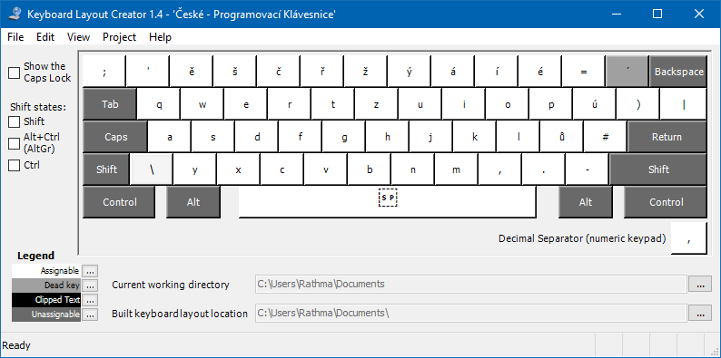
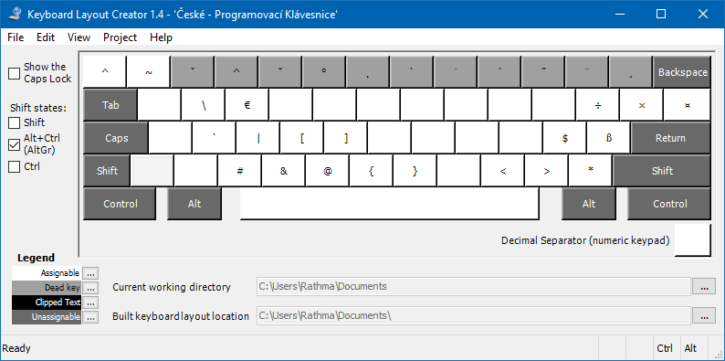

# czech-programming-keyboard
Czech programming keyboard for Windows preserves czech letters while it also provides all relevant symbols for programming without need to switch to some other keyboard layout. Created with help of Microsoft Keyboard Layout Creator 1.4.

Note: For numbers use numpad.

## Install

Run *bin/setup.exe* to install keyboard on your system. Then set it as default in languages and keyboard settings in Windows.

## Edit

Install Microsoft Keyboard Layout Creator 1.4 and edit *keyboard-layout.klc* file.

## Normal state

## Shift state

## Alt + Ctrl state

